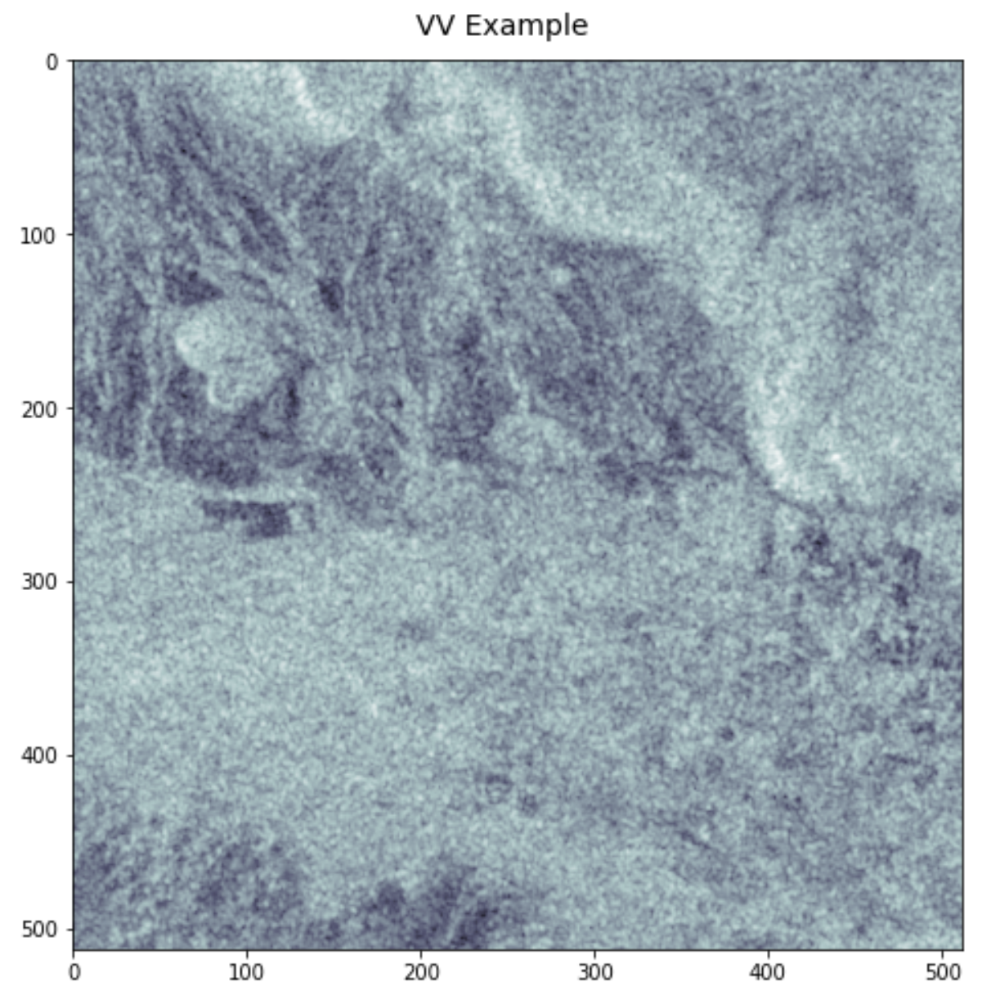
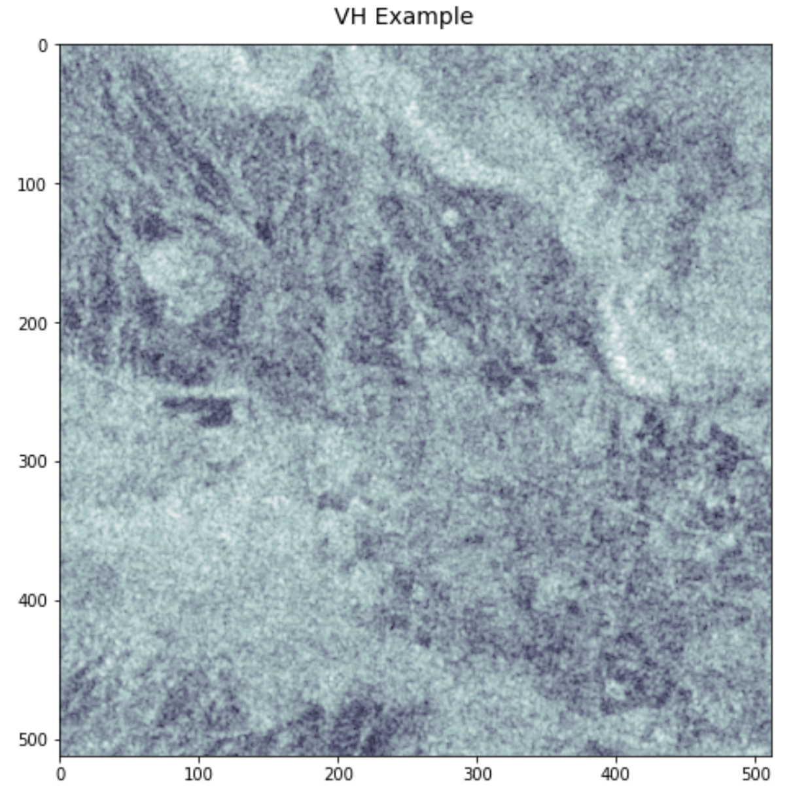

# Machine Learning Engineer Nanodegree
## Capstone Project
Jacques Thibodeau  
October 13th, 2021

## I. Definition

### Project Overview

Floods have always led to terrible tragedies. Over the centuries, humanity has learned to build infrastructure to prevent floods, yet many people still suffer and die from floods.

Another approach we can take in terms of prevention is to apply machine learning to predict when a flood is about to happen so that we can evacuate and protect ourselves sooner to mitigate the flooding impact. There are many approaches we can take to do this, but one approach involves using satellite imagery to detect the presence of floodwater via semantic segmentation (classifying each pixel in an image as “does this pixel contain floodwater or not?”).

This is easier said than done. We can use satellites with cameras operating in the visible wavelength range, but those images can be obscured by fog and clouds. One way to deal with this issue is to use cameras that take photos in the microwave wavelength band. The microwave wavelength band is not obscured by cloud and fog and we are able to see right through them while still having a view of the Earth.

As someone who is focused on using AI for good, this project is a great opportunity. As we improve our approach to predict natural disasters before they happen, we can reduce suffering and save lives. It is especially important to act on this quickly due to the increasing impacts of climate change.

This project is an extension of the “STAC Overflow: Map Floodwater from Radar Imagery” competition on DrivenData.org: https://www.drivendata.org/competitions/81/detect-flood-water/page/386/

The dataset we’ll be using is a subset of the Sentinel-1 dataset, which contains radar images stored as 512 x 512 pixel GeoTIFFs.

VV Polarization example:

VH Polarization example:

The following quotes are from the DrivenData competition page (Training set - Images): https://www.drivendata.org/competitions/81/detect-flood-water/page/386/

“Each pixel in a radar image represents the energy that was reflected back to the satellite measured in decibels (dB). Pixel values can range from negative to positive values. A pixel value of 0.0 indicates missing data.”

“Sentinel-1 is a phase-preserving dual-polarization SAR system, meaning that it can receive a signal in both horizontal and vertical polarizations. Different polarizations can be used to bring out different physical properties in a scene. The data for this challenge includes two microwave frequency readings: VV (vertical transmit, vertical receive) and VH (vertical transmit, horizontal receive).”

### Problem Statement

For this project, we are trying to build a machine learning model that can do semantic segmentation of floodwater in order to build a tool that provides us with early warnings that can help save lives and reduce damages from floods. This means that we are trying to separate the areas in an image where there is floodwater and the areas where there is no floodwater. 

We will be using synthetic-aperture radar (SAR) imagery to predict the presence of floodwater. This type of image data is different from typical image data and, therefore, our the deep learning models typically used for image segmentation will not work as well compared to regular RGB images. This is because the pre-trained models we are using for transfer learning were typically trained on a dataset with very few (or none) SAR images. In this case, we'll be using pre-trained models (the backbone of our model) that were trained on imagenet, which does not have SAR images. For this reason, we can expect it will be much harder for our model to perform well.

We will be using a Unet and DeepLabV3 models with a encoder backbone model (ex: Resnet34) to do segmentation. We use this approach as it has been shown to perform exceptionally well on semantic segmentation tasks. We will be using the PyTorch Lightning and Segmentation Models (PyTorch) libraries to train our models. In order to get a good model, we'll train 2 models with SageMaker's HyperparameterTuning feature and choose the best model for deployment.

Ultimately, our goal is to feed the model images in both the vh and vv polarizations and output a prediction of the floodwater locations in those images. We won't be too concerned about prediction performance since this project is about creating an end-to-end project with SageMaker and it would cost too much money to train many models in SageMaker.

We will also build a Streamlit app in order to perform inference on the model endpoint with the SageMaker SDK.

So, we will:

* Do data exploration on the SAR images
* Preprocess the data
* Load data to S3
* Train two models using SageMaker's HyperparameterTuning function
* Select the best model for deployment
* Deploy the model
* Perform inference on the deployed model in the notebook
* Perform inference on the deployed model in the Streamlit webapp

### Metrics
In this section, you will need to clearly define the metrics or calculations you will use to measure performance of a model or result in your project. These calculations and metrics should be justified based on the characteristics of the problem and problem domain. Questions to ask yourself when writing this section:
- _Are the metrics you’ve chosen to measure the performance of your models clearly discussed and defined?_
- _Have you provided reasonable justification for the metrics chosen based on the problem and solution?_

Our goal is to get the highest performance we can on the Jaccard index metric (also known as Generalized Intersection over Union (IoU)). The Jaccard index measures the similarity between two label sets. In this case, it measures the size of the intersection divided by the size of the union of non-missing pixels. In other words, it measures how accurately we have segmented floodwater from other matter.

where A is the set of true pixels and B is the set of predicted pixels.

Ref (Performance metric): https://www.drivendata.org/competitions/81/detect-flood-water/page/386/

## II. Analysis
_(approx. 2-4 pages)_

### Data Exploration
In this section, you will be expected to analyze the data you are using for the problem. This data can either be in the form of a dataset (or datasets), input data (or input files), or even an environment. The type of data should be thoroughly described and, if possible, have basic statistics and information presented (such as discussion of input features or defining characteristics about the input or environment). Any abnormalities or interesting qualities about the data that may need to be addressed have been identified (such as features that need to be transformed or the possibility of outliers). Questions to ask yourself when writing this section:
- _If a dataset is present for this problem, have you thoroughly discussed certain features about the dataset? Has a data sample been provided to the reader?_
- _If a dataset is present for this problem, are statistics about the dataset calculated and reported? Have any relevant results from this calculation been discussed?_
- _If a dataset is **not** present for this problem, has discussion been made about the input space or input data for your problem?_
- _Are there any abnormalities or characteristics about the input space or dataset that need to be addressed? (categorical variables, missing values, outliers, etc.)_

### Exploratory Visualization
In this section, you will need to provide some form of visualization that summarizes or extracts a relevant characteristic or feature about the data. The visualization should adequately support the data being used. Discuss why this visualization was chosen and how it is relevant. Questions to ask yourself when writing this section:
- _Have you visualized a relevant characteristic or feature about the dataset or input data?_
- _Is the visualization thoroughly analyzed and discussed?_
- _If a plot is provided, are the axes, title, and datum clearly defined?_

### Algorithms and Techniques
In this section, you will need to discuss the algorithms and techniques you intend to use for solving the problem. You should justify the use of each one based on the characteristics of the problem and the problem domain. Questions to ask yourself when writing this section:
- _Are the algorithms you will use, including any default variables/parameters in the project clearly defined?_
- _Are the techniques to be used thoroughly discussed and justified?_
- _Is it made clear how the input data or datasets will be handled by the algorithms and techniques chosen?_

### Benchmark
In this section, you will need to provide a clearly defined benchmark result or threshold for comparing across performances obtained by your solution. The reasoning behind the benchmark (in the case where it is not an established result) should be discussed. Questions to ask yourself when writing this section:
- _Has some result or value been provided that acts as a benchmark for measuring performance?_
- _Is it clear how this result or value was obtained (whether by data or by hypothesis)?_

For the benchmark, we will be using the benchmark from the benchmark blog post of the competition: https://www.drivendata.co/blog/detect-floodwater-benchmark/ 

The benchmark model is a U-Net model with a ResNet34 as the backbone of the model. This model performs well in most cases when it comes to semantic segmentation tasks. The model starts out as a typical vision model as the backbone (in this case ResNet34), and then that serves as input to the remaining layers which are in a U-Net architecture. A U-Net architecture is divided into two parts: the contracting part which follows the typical CNN architecture which downsamples for classification, followed by an expansive part that upsamples the feature map to an output segmentation map. The second part is crucial for segmentation because in image segmentation we not only need to convert the feature map into a vector but also reconstruct the image from this vector so that we can segment the image.

## III. Methodology
_(approx. 3-5 pages)_

### Data Preprocessing
In this section, all of your preprocessing steps will need to be clearly documented, if any were necessary. From the previous section, any of the abnormalities or characteristics that you identified about the dataset will be addressed and corrected here. Questions to ask yourself when writing this section:
- _If the algorithms chosen require preprocessing steps like feature selection or feature transformations, have they been properly documented?_
- _Based on the **Data Exploration** section, if there were abnormalities or characteristics that needed to be addressed, have they been properly corrected?_
- _If no preprocessing is needed, has it been made clear why?_

### Implementation
In this section, the process for which metrics, algorithms, and techniques that you implemented for the given data will need to be clearly documented. It should be abundantly clear how the implementation was carried out, and discussion should be made regarding any complications that occurred during this process. Questions to ask yourself when writing this section:
- _Is it made clear how the algorithms and techniques were implemented with the given datasets or input data?_
- _Were there any complications with the original metrics or techniques that required changing prior to acquiring a solution?_
- _Was there any part of the coding process (e.g., writing complicated functions) that should be documented?_

### Refinement
In this section, you will need to discuss the process of improvement you made upon the algorithms and techniques you used in your implementation. For example, adjusting parameters for certain models to acquire improved solutions would fall under the refinement category. Your initial and final solutions should be reported, as well as any significant intermediate results as necessary. Questions to ask yourself when writing this section:
- _Has an initial solution been found and clearly reported?_
- _Is the process of improvement clearly documented, such as what techniques were used?_
- _Are intermediate and final solutions clearly reported as the process is improved?_

## IV. Results
_(approx. 2-3 pages)_

### Model Evaluation and Validation
In this section, the final model and any supporting qualities should be evaluated in detail. It should be clear how the final model was derived and why this model was chosen. In addition, some type of analysis should be used to validate the robustness of this model and its solution, such as manipulating the input data or environment to see how the model’s solution is affected (this is called sensitivity analysis). Questions to ask yourself when writing this section:
- _Is the final model reasonable and aligning with solution expectations? Are the final parameters of the model appropriate?_
- _Has the final model been tested with various inputs to evaluate whether the model generalizes well to unseen data?_
- _Is the model robust enough for the problem? Do small perturbations (changes) in training data or the input space greatly affect the results?_
- _Can results found from the model be trusted?_

### Justification
In this section, your model’s final solution and its results should be compared to the benchmark you established earlier in the project using some type of statistical analysis. You should also justify whether these results and the solution are significant enough to have solved the problem posed in the project. Questions to ask yourself when writing this section:
- _Are the final results found stronger than the benchmark result reported earlier?_
- _Have you thoroughly analyzed and discussed the final solution?_
- _Is the final solution significant enough to have solved the problem?_

## V. Conclusion
_(approx. 1-2 pages)_

### Free-Form Visualization
In this section, you will need to provide some form of visualization that emphasizes an important quality about the project. It is much more free-form, but should reasonably support a significant result or characteristic about the problem that you want to discuss. Questions to ask yourself when writing this section:
- _Have you visualized a relevant or important quality about the problem, dataset, input data, or results?_
- _Is the visualization thoroughly analyzed and discussed?_
- _If a plot is provided, are the axes, title, and datum clearly defined?_

### Reflection
In this section, you will summarize the entire end-to-end problem solution and discuss one or two particular aspects of the project you found interesting or difficult. You are expected to reflect on the project as a whole to show that you have a firm understanding of the entire process employed in your work. Questions to ask yourself when writing this section:
- _Have you thoroughly summarized the entire process you used for this project?_
- _Were there any interesting aspects of the project?_
- _Were there any difficult aspects of the project?_
- _Does the final model and solution fit your expectations for the problem, and should it be used in a general setting to solve these types of problems?_

### Improvement
In this section, you will need to provide discussion as to how one aspect of the implementation you designed could be improved. As an example, consider ways your implementation can be made more general, and what would need to be modified. You do not need to make this improvement, but the potential solutions resulting from these changes are considered and compared/contrasted to your current solution. Questions to ask yourself when writing this section:
- _Are there further improvements that could be made on the algorithms or techniques you used in this project?_
- _Were there algorithms or techniques you researched that you did not know how to implement, but would consider using if you knew how?_
- _If you used your final solution as the new benchmark, do you think an even better solution exists?_

-----------

**Before submitting, ask yourself. . .**

- Does the project report you’ve written follow a well-organized structure similar to that of the project template?
- Is each section (particularly **Analysis** and **Methodology**) written in a clear, concise and specific fashion? Are there any ambiguous terms or phrases that need clarification?
- Would the intended audience of your project be able to understand your analysis, methods, and results?
- Have you properly proof-read your project report to assure there are minimal grammatical and spelling mistakes?
- Are all the resources used for this project correctly cited and referenced?
- Is the code that implements your solution easily readable and properly commented?
- Does the code execute without error and produce results similar to those reported?
