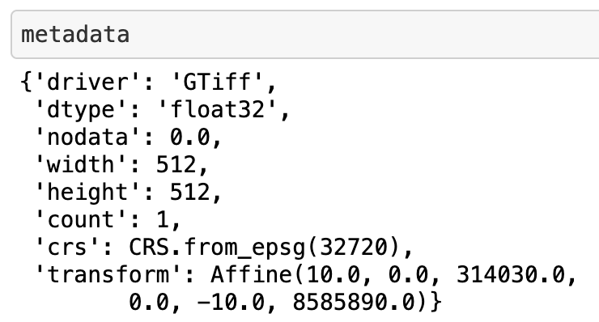
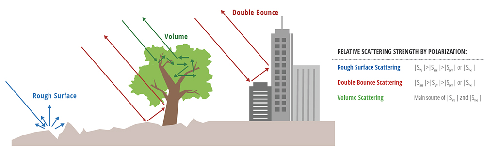
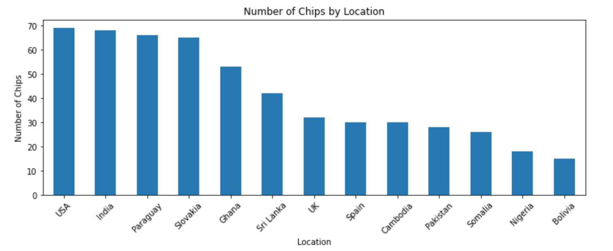

# Machine Learning Engineer Nanodegree
## Mapping Floodwater with SAR Imagery Capstone Project
Jacques Thibodeau  
October 26th, 2021

## I. Definition

### Project Overview

Floods have always led to terrible tragedies. Over the centuries, humanity has learned to build infrastructure to prevent floods, yet many people still suffer and die from floods.

Another approach we can take in terms of prevention is to apply machine learning to predict when a flood is about to happen so that we can evacuate and protect ourselves sooner to mitigate the flooding impact. There are many approaches we can take to do this, but one approach involves using satellite imagery to detect the presence of floodwater via semantic segmentation (classifying each pixel in an image as “does this pixel contain floodwater or not?”).

This is easier said than done. We can use satellites with cameras operating in the visible wavelength range, but those images can be obscured by fog and clouds. One way to deal with this issue is to use cameras that take photos in the microwave wavelength band. The microwave wavelength band is not obscured by cloud and fog and we are able to see right through them while still having a view of the Earth.

Each piece of land that the satellite's camera takes pictures of will have two images, one image in the VH polarization of light (vertical transmit and horizontal receive) and another in the VV polarization (vertical transmit and vertical receive). Both polarization bring out different characteristics in their images, allowing our model to learn all the intricacies of the land and better seperate floodwater from non-floodwater.

In order to train our model to be able to separate floodwater from non-floodwater, we also have label masks that go with every pair of VV and VH images. So, our goal is to train a model that can map the VV and VH images to the label mask images where every pixel has been annotated as floodwater or non-floodwater.

As someone who is focused on using AI for good, this project is a great opportunity. As we improve our approach to predict natural disasters before they happen, we can reduce suffering and save lives. It is especially important to act on this quickly due to the increasing impacts of climate change.

This project is an extension of the “STAC Overflow: Map Floodwater from Radar Imagery” competition on DrivenData.org: https://www.drivendata.org/competitions/81/detect-flood-water/page/386/

### Problem Statement

For this project, we are trying to build a machine learning model that can do semantic segmentation of floodwater in order to build a tool that provides us with early warnings that can help save lives and reduce damages from floods. This means that we are trying to separate the areas in an image where there is floodwater and the areas where there is no floodwater. 

We will be using synthetic-aperture radar (SAR) imagery to predict the presence of floodwater. This type of image data is different from typical image data and, therefore, our the deep learning models typically used for image segmentation will not work as well compared to regular RGB images. This is because the pre-trained models we are using for transfer learning were typically trained on a dataset with very few (or none) SAR images. In this case, we'll be using pre-trained models (the backbone of our model) that were trained on imagenet, which does not have SAR images. For this reason, we can expect it will be much harder for our model to perform well.

We will be using a Unet and DeepLabV3 models with a encoder backbone model (ex: Resnet34) to do segmentation. We use this approach as it has been shown to perform exceptionally well on semantic segmentation tasks. We will be using the PyTorch Lightning and Segmentation Models (PyTorch) libraries to train our models. In order to get a good model, we'll train 2 models with SageMaker's HyperparameterTuning feature and choose the best model for deployment.

Ultimately, our goal is to feed the model images in both the vh and vv polarizations and output a prediction of the floodwater locations in those images. We won't be too concerned about prediction performance since this project is about creating an end-to-end project with SageMaker and it would cost too much money to train many models in SageMaker.

We will also build a Streamlit app in order to perform inference on the model endpoint with the SageMaker SDK.

So, we will:

* Do data exploration on the SAR images
* Preprocess the data
* Load data to S3
* Train models using SageMaker's HyperparameterTuning function (in the notebook we commented out the hyperparameter tuning job to reduce runtime)
* Select the best model for deployment
* Deploy the model
* Perform inference on the deployed model in the notebook
* Perform inference on the deployed model in the Streamlit webapp

### Metrics

Our goal is to get the highest performance we can on the Jaccard index metric (also known as Generalized Intersection over Union (IoU)). The Jaccard index measures the similarity between two label sets. In this case, it measures the size of the intersection divided by the size of the union of non-missing pixels. In other words, it measures how accurately we have segmented floodwater from other matter. If predicted segmentation matches exactly like the ground truth, we will get a Jaccard index value of 1.0. The lower the value (down to 0), the lower the overlap between the predicted segmentation versus the ground truth segmentation.

where A is the set of true pixels and B is the set of predicted pixels.

Ref (Performance metric): https://www.drivendata.org/competitions/81/detect-flood-water/page/386/

## II. Analysis

### Data Exploration

The dataset we’ll be using is a subset of the Sentinel-1 dataset, which contains radar images stored as 512 x 512 pixel GeoTIFFs. In order to train our model to be able to separate floodwater from non-floodwater, we also have label masks that go with every pair of VV and VH images. 

In GeoTIFFS, we have the image data as well as other metadata regarding the image, as we can see here:

This metadata gives us information like "nodata" which let's us know which values in the image are described as missing. In this case, all 0.0 values in the image are "missing values." We can also grab the bounding coordinates from the GeoTIFF (where was the image taken on Earth):

Along with the GeoTIFFs, we have a metadata csv of the images that we use to identify each `chip_id` along with its corresponding images of both polarizations.

The following quotes are from the DrivenData competition page (Training set - Images): https://www.drivendata.org/competitions/81/detect-flood-water/page/386/

> Each pixel in a radar image represents the energy that was reflected back to the satellite measured in decibels (dB). Pixel values can range from negative to positive values. A pixel value of 0.0 indicates missing data.

> Sentinel-1 is a phase-preserving dual-polarization SAR system, meaning that it can receive a signal in both horizontal and vertical polarizations. Different polarizations can be used to bring out different physical properties in a scene. The data for this challenge includes two microwave frequency readings: VV (vertical transmit, vertical receive) and VH (vertical transmit, horizontal receive).

After looking at our data, there were no abnormalities we needed to fix in the dataset.

Note: we could have added additional data from the Microsoft Planetary Computer to augment our dataset with information about things such as elevation, but you need to ask for special permission from Microsoft to have access. I gained access and I was able to work with the data in Colab, but I left it out of SageMaker since the project reviewer will not have access.

### Exploratory Visualization

Since the images are not taken in the human visible wavelength range, we need to apply a false color composite if we want to visualize the images. However, this is only for visualization, we will not be using the false color composite images as training data.

VV Polarization example:

VH Polarization example:

Each image has a `chip_id` associated with it. There is 

Notice how some countries have a lot more chips than others. We will not be taking this into account for our model, but you could imagine that some types of images will be more common in the dataset than others. Therefore, it may be that the model performs well on US data (for example), but performs poorly on Bolivia data since it simply does not have enough data for that kind of terrain. If we wanted to further fine-tune the model, we could identify the types of locations where the model is performing poorly and work to improve on those kinds of terrains. For example, you could create a specialized model for that kind of data and include it in an ensemble. You could also find those types of images and pre-train a model before fine-tuning it.

Pixel values represent energy that was reflected back to the satellite measured in decibels. To better visualize the bands or channels of Sentinel-1 images, we will create a false color composite by treating the two bands and their ratio as red, green, and blue channels, respectively. The yellow indicates missing values. The teal blue in the right image indicates the water label mask we are trying to predict.

### Algorithms and Techniques

Our task is to do semantic segmentation of satellite-aperture radar imagery in order to classify each pixel in an image as to whether is contains floodwater or not. The state-of-the-art techniques in this domain involve using a deep learning model where the first portion of the neural network (the backbone/encoder) is a pre-trained model like ResNet34 and we attach a Unet-like architecture to the output of the backbone model.

This is what a Unet architecture looks like:

A U-Net architecture is divided into two parts: the contracting part which follows the typical CNN architecture which downsamples for classification, followed by an expansive part that upsamples the feature map to an output segmentation map. The second part is crucial for segmentation because in image segmentation we not only need to convert the feature map into a vector but also reconstruct the image from this vector so that we can segment the image.

When training our model, we will be focus on three different configuration changes to improve our model: model architecture (Unet or other model heads like DeepLabV3, UnetPlusPlus, DeepLabV3Plus), backbone model (ResNet34, EfficientNet-b0, xception), and learning rate (0.001, 0.0003, 0.0001). We did several hyperparameter tuning jobs with a combination of all of those configuration possibilities.

To feed the image data to our model, we first have to stack the arrays of the VH and VV images together. Then, we apply a min-max normalization on the input pixel values (unique for our dataset; makes sure we have no negative values and normalizes across pixels), apply data augmentations with the Albumentations package (ex: RandomCrop, RandomRotate90, HorizontalFlip, and VerticalFlip), and then pass those values to our model for training.

I wanted to try creating a final ensemble model of the best models, but it was a bit too complicated to do in SageMaker and wasn't worth the effort.

### Benchmark

For the benchmark, we can start by looking at the benchmark from the blog post of the competition: https://www.drivendata.co/blog/detect-floodwater-benchmark/ 

The blog post ended up with a validation IOU of 0.3069. I ended up with 0.32162. Perhaps this was because I trained if for longer. We'll use our performance of 0.32162 as the benchmark.

The benchmark model is a U-Net model with a ResNet34 as the backbone of the model. This model performs well in most cases when it comes to semantic segmentation tasks. The model starts out as a typical vision model as the backbone (in this case ResNet34), and then that serves as input to the remaining layers which are in a U-Net architecture. This type of model is often what people use when starting a semantic segmentation project and they want to quickly build an end-to-end pipeline. Therefore, it's the perfect model to choose as a benchmark.

## III. Methodology
_(approx. 3-5 pages)_

### Data Preprocessing
In this section, all of your preprocessing steps will need to be clearly documented, if any were necessary. From the previous section, any of the abnormalities or characteristics that you identified about the dataset will be addressed and corrected here. Questions to ask yourself when writing this section:
- _If the algorithms chosen require preprocessing steps like feature selection or feature transformations, have they been properly documented?_
- _Based on the **Data Exploration** section, if there were abnormalities or characteristics that needed to be addressed, have they been properly corrected?_
- _If no preprocessing is needed, has it been made clear why?_

Before model training, we need to prepare the data in a specific way.

First, we split the data (with a random seed) to create a training set and a validation set. Then, we create a dataframe where each row describes a `chip_id`, which links to the set of VH and VV images. We need to make sure that the path to the training files are properly created in the dataframe. Since our model is trained in a Docker container, we need to set the filepaths to the paths the dataset will be downloaded to in the Docker container. This is in the `/opt/ml/input/data/data_s3_uri/` subdirectory.

To feed the image data to our model, we read the images as numpy arrays and then we have to stack the arrays of the VH and VV images together. Then, we apply a min-max normalization on the input pixel values (unique for our dataset; makes sure we have no negative values and normalizes across pixels), apply data augmentations with the Albumentations package (ex: RandomCrop, RandomRotate90, HorizontalFlip, and VerticalFlip), and then pass those values to our model for training.

### Implementation
In this section, the process for which metrics, algorithms, and techniques that you implemented for the given data will need to be clearly documented. It should be abundantly clear how the implementation was carried out, and discussion should be made regarding any complications that occurred during this process. Questions to ask yourself when writing this section:
- _Is it made clear how the algorithms and techniques were implemented with the given datasets or input data?_
- _Were there any complications with the original metrics or techniques that required changing prior to acquiring a solution?_
- _Was there any part of the coding process (e.g., writing complicated functions) that should be documented?_

### Refinement

I started by training a model using the same configuration as the Benchmark blog post:

* Architecture: Unet
* Encoder/Backbone model: ResNet34
* Learning Rate: 0.001

The blog post ended up with a validation IOU of 0.3069. I ended up with 0.32162. Perhaps this was because I trained if for longer.

Afterwards, I wanted to tune the hyperparameters so I trained many models in SageMaker using the Hyperparameter Tuning feature and in Google Colab (we used Weights and Biases to train the models), and we found that the best configuration for our model is the following:

(Best model configuration found using a Weights and Biases Hyperparameter Sweep in Google Colab)
* Architecture: Unet
* Encoder/Backbone model: EfficientNet-b0
* Learning Rate: 0.001

This gave us a validation IOU (our comparison metric) of 0.405 in Colab, which is much better than what was obtained in the benchmark blog post (0.3069).

Here's the results of the hyperparameter sweep we ran with Weights and Biases, the selected hyperparameter curve shows our best model:

I also tried different data augmentation configurations, but I wasn't getting better results so I stuck with the ones I have.

**Final Model:** Our final model that I trained in SageMaker got us a validation IOU of 0.43338 (using the same parameters as the best Colab model), much higher than the benchmark.

## IV. Results
_(approx. 2-3 pages)_

### Model Evaluation and Validation
In this section, the final model and any supporting qualities should be evaluated in detail. It should be clear how the final model was derived and why this model was chosen. In addition, some type of analysis should be used to validate the robustness of this model and its solution, such as manipulating the input data or environment to see how the model’s solution is affected (this is called sensitivity analysis). Questions to ask yourself when writing this section:
- _Is the final model reasonable and aligning with solution expectations? Are the final parameters of the model appropriate?_
- _Has the final model been tested with various inputs to evaluate whether the model generalizes well to unseen data?_
- _Is the model robust enough for the problem? Do small perturbations (changes) in training data or the input space greatly affect the results?_
- _Can results found from the model be trusted?_

### Justification
In this section, your model’s final solution and its results should be compared to the benchmark you established earlier in the project using some type of statistical analysis. You should also justify whether these results and the solution are significant enough to have solved the problem posed in the project. Questions to ask yourself when writing this section:
- _Are the final results found stronger than the benchmark result reported earlier?_
- _Have you thoroughly analyzed and discussed the final solution?_
- _Is the final solution significant enough to have solved the problem?_

## V. Conclusion
_(approx. 1-2 pages)_

### Free-Form Visualization
In this section, you will need to provide some form of visualization that emphasizes an important quality about the project. It is much more free-form, but should reasonably support a significant result or characteristic about the problem that you want to discuss. Questions to ask yourself when writing this section:
- _Have you visualized a relevant or important quality about the problem, dataset, input data, or results?_
- _Is the visualization thoroughly analyzed and discussed?_
- _If a plot is provided, are the axes, title, and datum clearly defined?_

### Reflection
In this section, you will summarize the entire end-to-end problem solution and discuss one or two particular aspects of the project you found interesting or difficult. You are expected to reflect on the project as a whole to show that you have a firm understanding of the entire process employed in your work. Questions to ask yourself when writing this section:
- _Have you thoroughly summarized the entire process you used for this project?_
- _Were there any interesting aspects of the project?_
- _Were there any difficult aspects of the project?_
- _Does the final model and solution fit your expectations for the problem, and should it be used in a general setting to solve these types of problems?_

### Improvement

**To improve our model performance results, we can do some of the following things:**

* Use an ensemble of the models (I tried to do this, but deployed ensembles are a little complicated in SageMaker and the documentation is not too clear so I decided I would only deploy a single model).
* If we use an ensembled model, we can decide to use the max value of either model in the ensemble since this will bias towards predicting floodwater. Based on the predictions we get from the model, it seems that the model is more likely to miss predicting floodwater over non-floodwater. Therefore, it would make sense to choose the max in case one of the models is predicting floodwater and another one (incorrectly) isn't.
* The models added to the ensemble could also be something like a [CatBoostedClassifier](https://catboost.ai/en/docs/concepts/python-reference_catboostclassifier) that predicts every pixel. From their website: "CatBoost is a machine learning algorithm that uses gradient boosting on decision trees."
* Train many more models using different albumentations, backbone models, architectures (head), and loss functions.
* We could use the additional data from Microsoft Planetary Computer. In particular, the Nasadem band is an incredibly important.
* We could pre-train a deep learning model on Satellite-Aperture Radar (SAR) images because the current backbone/encoder models used in Semantic Segmentation are pre-trained on imagenet (a large image dataset), which does not have SAR images. This means that the model weights of ResNet34 or EfficientNet-b0 were not updated to recognize SAR images. Therefore, if we pre-train a model on a large dataset of SAR images, we could expect that the model we fine-tune with that pre-trained model will perform a lot better than a pre-trained imagenet model.

**For our web app:**

* Allowing the user to load all images at once and then choosing which ones they would like to predict.
* Storing the predictions in a database.
* Setup a lambda + API Gateway endpoint to reduce the cost per API call.
* Send a continuous stream of images through our model endpoint as if we are using the endpoint to predict flooding in real-time in order to save lives and reduce damages.

-----------

**Before submitting, ask yourself. . .**

- Does the project report you’ve written follow a well-organized structure similar to that of the project template?
- Is each section (particularly **Analysis** and **Methodology**) written in a clear, concise and specific fashion? Are there any ambiguous terms or phrases that need clarification?
- Would the intended audience of your project be able to understand your analysis, methods, and results?
- Have you properly proof-read your project report to assure there are minimal grammatical and spelling mistakes?
- Are all the resources used for this project correctly cited and referenced?
- Is the code that implements your solution easily readable and properly commented?
- Does the code execute without error and produce results similar to those reported?
